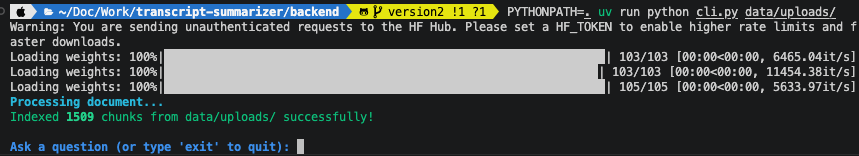
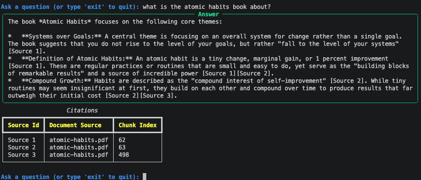
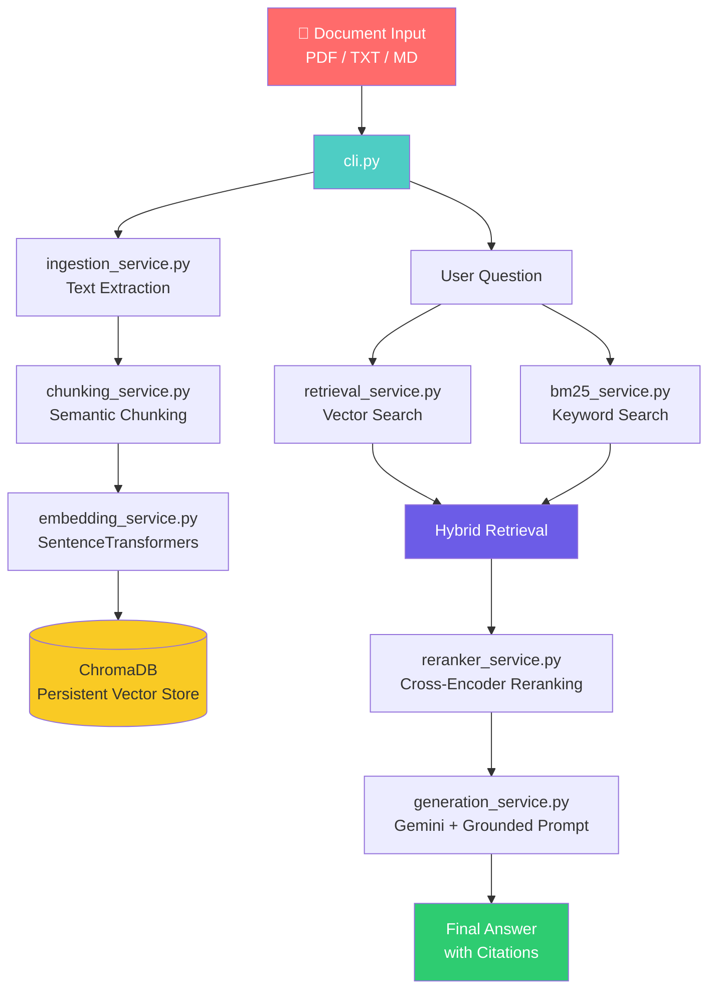
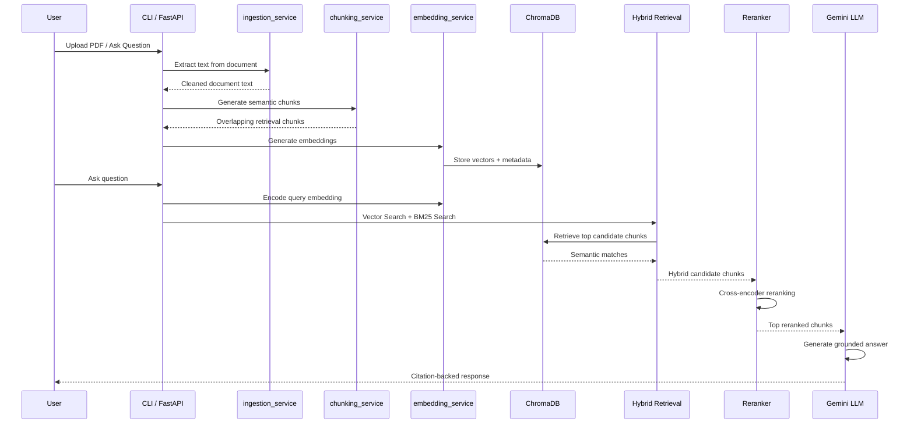

<p align="center">
  <h1 align="center">🧠 RAG Learning Assistant</h1>
  <p align="center">
    <strong>Production-grade RAG pipeline that turns documents into citation-grounded question-answering systems.</strong>
  </p>
  <p align="center">
    <a href="#features"></a>
    
    
    
    
    
  </p>
</p>

---

## 📌 Overview

**RAG Learning Assistant** is a production-style Retrieval-Augmented Generation system that allows users to upload documents and ask natural language questions with citation-backed answers.

Built with a modular FastAPI backend, it handles the full AI pipeline from raw documents to grounded response generation:

```
Documents → Ingestion → Semantic Chunks → Embeddings → ChromaDB → Hybrid Retrieval → Reranking → Citation-Grounded Answer
```

---

## � Demo

### Indexing Documents

```bash
uv run python cli.py data/uploads/
```

<p align="center">
  
</p>


### Asking Questions

<p align="center">
  
</p>

---

## 🏗️ Architecture




### Module Responsibilities

| Module | Role |
|--------|------|
| `cli.py` | Typer + Rich command-line interface for indexing and querying documents |
| `api.py` | FastAPI service exposing `/documents` (indexing) and `/query` (Q&A) endpoints |
| `ingestion_service.py` | Extracts and cleans text from uploaded documents, page by page |
| `chunking_service.py` | Splits each page into overlapping retrieval-friendly chunks |
| `embedding_service.py` | Generates SentenceTransformers embeddings and stores them in ChromaDB |
| `bm25_retrieval_service.py` | Performs keyword-based `BM25` retrieval |
| `retrieval_service.py` | Runs vector search and hybrid retrieval |
| `reranker_service.py` | Reranks candidate chunks using a cross-encoder model |
| `generation_service.py` | Generates citation-grounded answers using retrieved evidence |

---

## ✨ Features

| # | Feature | Description |
|---|---------|-------------|
| 1 | **Document Ingestion** | Supports PDF, TXT, and Markdown document processing |
| 2 | **Page-Aware Chunking** | Splits documents into overlapping retrieval-friendly chunks, preserving page numbers |
| 3 | **Embedding Pipeline** | Uses SentenceTransformers to convert chunks into vector embeddings |
| 4 | **Persistent Vector Store** | Stores embeddings in ChromaDB for reusable semantic search |
| 5 | **Hybrid Retrieval** | Combines vector similarity search with BM25 keyword retrieval |
| 6 | **Cross-Encoder Reranking** | Reranks retrieved chunks for better answer relevance |
| 7 | **Citation-Grounded Answers** | Returns answers with source/chunk-level citations |
| 8 | **Hallucination Guardrails** | Refuses unsupported questions when retrieved evidence is insufficient |
| 9 | **Interactive CLI** | Typer + Rich powered local document QA experience |
---

## 🚀 Quick Start

### Prerequisites

```bash
uv sync
```

### Set Your API Key

```bash
# Windows (PowerShell)
$env:GEMINI_API_KEY="your_key_here"

# Windows (CMD)
set GEMINI_API_KEY=your_key_here

# macOS / Linux
export GEMINI_API_KEY=your_key_here
```

> Get your free API key from the [Google Cloud Console](https://console.cloud.google.com/apis/credentials).


## 💻 Usage

### CLI

```bash
uv run python cli.py data/uploads/
```

### API

```bash
uv run uvicorn api:app --reload
```

| Endpoint | Description |
|----------|-------------|
| `GET /health` | Liveness check |
| `POST /documents` | Upload and index a document (multipart file upload) |
| `POST /query` | Ask a question against the indexed knowledge base |

```bash
curl -X POST http://127.0.0.1:8000/documents -F "file=@data/uploads/atomic-habits.pdf"

curl -X POST http://127.0.0.1:8000/query \
  -H "Content-Type: application/json" \
  -d '{"question": "How do habits compound over time?", "top_k": 3}'
```

Interactive docs are available at `/docs` once the server is running.

### Docker

```bash
docker compose up --build
```

This builds the image, starts the API on `http://localhost:8000`, and mounts `data/chromaDB/` and `data/uploads/` as volumes so indexed documents persist across container restarts. Requires a `GEMINI_API_KEY` in `.env` (see [Set Your API Key](#set-your-api-key) above).

## 📂 Project Structure

```
├── core/
│   └── config.py
├── services/
│   ├── ingestion_service.py
│   ├── chunking_service.py
│   ├── embedding_service.py
│   ├── bm25_retrieval_service.py
│   ├── retrieval_service.py
│   ├── reranker_service.py
│   └── generation_service.py
├── api.py
├── cli.py
├── tests/
├── data/
│   ├── chromaDB/
│   └── uploads/
└── pyproject.toml
```
---
## 📁 Document Upload Directory

Create the following directory inside the backend:

```text
data/uploads/
```

Place all supported documents inside this folder before running the CLI.

### Supported Formats

- `.pdf`
- `.txt`
- `.md`

### Example

```text
data/
  └── uploads/
      ├── atomic-habits.pdf
      ├── deep-learning.txt
      └── notes.md
```

The CLI can index:
- a single document
- or the entire uploads directory

### Index All Documents

```bash
uv run python cli.py data/uploads/
```

### Index a Single Document

```bash
uv run python cli.py data/uploads/atomic-habits.pdf
```
---

## 🧠 How the AI Pipeline Works



---

## 📊 Output Schema

### RAG Chunk (JSONL)

```json
{
  "chunk_id": "atomic-habits.pdf_chunk_42",
  "source": "atomic-habits.pdf",
  "page": 12,
  "chunk_index": 42,
  "text": "Habits are the compound interest of self-improvement..."
}
```

### 🔍 Retrieval Result Schema
```json
{
  "source": "atomic-habits.pdf",
  "page": 12,
  "chunk_index": 42,
  "hybrid_score": 1.25,
  "rerank_score": 8.91,
  "text": "Habits are the compound interest of self-improvement..."
}
```

---

## 🛡️ Hallucination Prevention

The assistant is instructed to answer only from retrieved context. If the retrieved chunks do not provide enough evidence, it refuses to answer instead of generating unsupported claims.

Example:

```
 I don't have enough evidence to answer that.
```
---

## 📋 Requirements

| Package | Purpose |
|---------|---------|
| `langchain` | Prompt orchestration |
| `langchain-google-genai` | Gemini API integration |
| `chromadb` | Persistent vector database |
| `sentence-transformers` | Embedding generation |
| `rank-bm25` | Keyword-based retrieval |
| `pypdf` | PDF text extraction |
| `typer` | CLI framework |
| `rich` | CLI formatting and visualization |
| `uvicorn` | FastAPI ASGI server |
---

## 📄 License

This project is licensed under the MIT License.

---